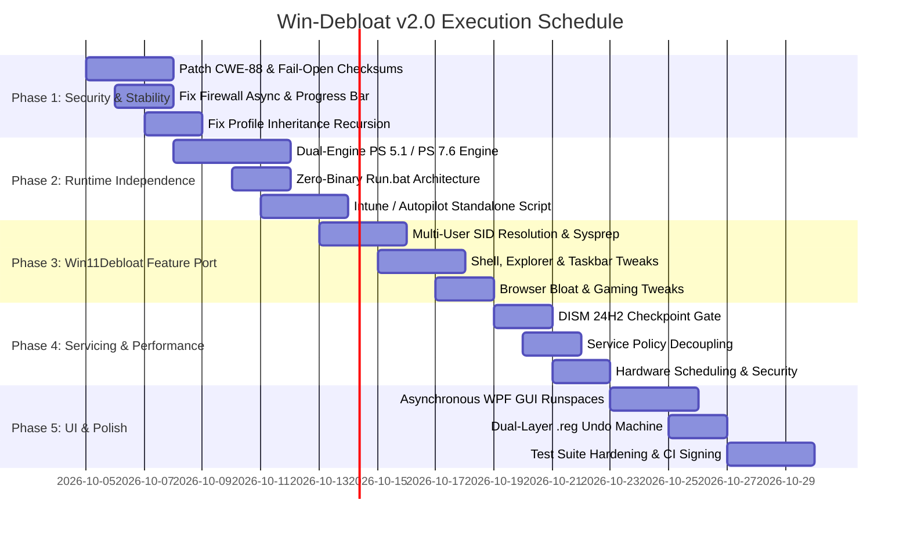

# Win-Debloat v2.0 "Apex Perfection" — Master Implementation Plan

> **Target Repository:** `C:\DEV\Win-Debloat-main`  
> **Target Goal:** Achieve a 10/10 Perfect Score across Software Architecture, Performance, Safety/Reliability, Feature Scope, Security Posture, and Enterprise Deployability.  
> **Source Intelligence:** 30 Specialized Research & Planning Agents scraping `Win11Debloat` (`c:\NNot dev\Win11Debloat-master`), `Sophia Script`, and production telemetry.

---

## Executive Architectural Strategy

`Win-Debloat` already possesses a superior engineering engine compared to procedural debloaters: it uses 30 structured `.psm1` modules, an $O(N)$ bulk compiled-regex AppX removal engine, native Win32 .NET registry pointers, and declarative YAML profile inheritance. 

However, `Win-Debloat` currently loses in production due to **6 critical vulnerabilities/crash traps**, **lack of native Windows PowerShell 5.1 execution** (which prevents enterprise Intune/OOBE deployment), and **unsigned C# launcher binaries** that trigger Windows 11 Smart App Control (SAC) blocks.

This implementation plan outlines the exact changes across **30 technical pillars** required to fix all defects, integrate all proven features from `Win11Debloat`, and make `Win-Debloat` the definitive, uncontested #1 Windows optimization platform in the world.

---

## Phase 1: Security Remediation & Runtime Crash Elimination (P0 Blockers)

### Pillar 1: Remediation of CWE-88 Argument Injection in Elevated C# Launcher
- **File:** `src\core\LauncherEmbed.cs:134–142` and `src\core\Launcher.cs:120–135`
- **Defect:** Unquoted CLI argument concatenation (`string argsString = string.Join(" ", args); string script = $"& $entry {argsString}";`) allows arbitrary command execution as Local Administrator.
- **Implementation:**
  1. Replace string concatenation with typed argument passing to `ProcessStartInfo.ArgumentList` (.NET Core / Framework 4.8 compatible) or encode user arguments as Base64 strings.
  2. Implement an allowlist regex pattern on all CLI arguments (`^[a-zA-Z0-9_\-\.:\\/\s=]+$`), rejecting shell metacharacters (`;`, `&`, `|`, `` ` ``, `$`, `\n`).
  ```csharp
  // Hardened Launcher Argument Passing
  var psi = new ProcessStartInfo {
      FileName = pwshPath,
      UseShellExecute = false,
      Verb = "RunAs"
  };
  psi.ArgumentList.Add("-NoProfile");
  psi.ArgumentList.Add("-ExecutionPolicy");
  psi.ArgumentList.Add("Bypass");
  psi.ArgumentList.Add("-File");
  psi.ArgumentList.Add(entryScriptPath);
  foreach (var arg in args) {
      if (Regex.IsMatch(arg, @"[;&|`$<>^]")) {
          throw new SecurityException($"Illegal characters detected in parameter: {arg}");
      }
      psi.ArgumentList.Add(arg);
  }
  ```

### Pillar 2: Hardening of Installer Checksum Verification (Fail-Closed)
- **File:** `setup-standard.ps1:50–72` and `setup-extras.ps1:50–72`
- **Defect:** A cryptographic hash mismatch throws an exception that is caught and logged as a yellow warning, proceeding to execute the untrusted archive with elevated privileges.
- **Implementation:**
  1. Enforce strict **Fail-Closed** semantics.
  2. Delete the downloaded zip immediately if the SHA256 does not match `$ExpectedHash`.
  3. Terminate the process with exit code 1.
  ```powershell
  # Fail-Closed Verification
  $actualHash = (Get-FileHash -Path $ZipPath -Algorithm SHA256).Hash
  if ($actualHash.ToLower() -ne $ExpectedHash.ToLower()) {
      Remove-Item -Path $ZipPath -Force -ErrorAction SilentlyContinue
      Write-Host "CRITICAL SECURITY ERROR: SHA256 hash mismatch!" -ForegroundColor Red
      Write-Host "Expected: $ExpectedHash" -ForegroundColor Red
      Write-Host "Actual:   $actualHash" -ForegroundColor Red
      throw [System.Security.SecurityException]"Package integrity check failed. Aborting installation."
  }
  ```

### Pillar 3: Resilient Asynchronous DNS in Telemetry Firewall Blocker
- **File:** `src\modules\Privacy\Firewall.psm1:185–205`
- **Defect:** `[System.Threading.Tasks.Task]::WaitAll($allTasks, 6000)` throws an unhandled `AggregateException` when non-routable/defunct endpoints fail DNS resolution, crashing the module 100% of the time.
- **Implementation:**
  1. Wrap `WaitAll` in an exception-tolerant try/catch specifically catching `[System.AggregateException]` and `[System.Management.Automation.MethodInvocationException]`.
  2. Filter tasks using `$task.Status -eq 'RanToCompletion'` or `$task.IsCompletedSuccessfully` before accessing `$task.Result`.
  3. Cache resolved IPs locally to disk (`config\resolved-telemetry-ips.json`) to allow instant firewall rule recreation in offline mode.
  ```powershell
  try {
      [System.Threading.Tasks.Task]::WaitAll($allTasks, 6000) | Out-Null
  } catch [System.AggregateException], [System.Management.Automation.MethodInvocationException] {
      # Expected: defunct test domains will fault tasks
  }
  $resolvedIPs = [System.Collections.Generic.HashSet[string]]::new()
  foreach ($item in $tasks) {
      if ($item.Task.Status -eq [System.Threading.Tasks.TaskStatus]::RanToCompletion) {
          foreach ($addr in $item.Task.Result) {
              [void]$resolvedIPs.Add($addr.IPAddressToString)
          }
      }
  }
  ```

### Pillar 4: Progress Bar Range Overflow Correction
- **File:** `src\modules\Performance\Performance.psm1:69, 254–292`
- **Defect:** Hardcoded `$totalSteps = 6` throws a terminating `ParameterBindingValidationException` in PowerShell 7 when `-PercentComplete` exceeds 100 at step 7+.
- **Implementation:**
  1. Dynamically compute `$totalSteps` based on active configuration flags.
  2. Clamp percentage calculations with `[math]::Clamp([int](($currentStep / [math]::Max(1, $totalSteps)) * 100), 0, 100)`.

### Pillar 5: Circular Profile Inheritance & Stack Overflow Guard
- **File:** `src\core\Config.psm1:818, 887`
- **Defect:** Recursive calls to `Import-WinDebloatConfig` reset the `visited` set and depth counter to 0, causing infinite CLR recursion and host crashes on mutual profile extensions (`A extends B`, `B extends A`).
- **Implementation:**
  1. Pass the active `HashSet[string] $VisitedChain` and `[int]$CurrentDepth` through all internal profile resolution calls.
  2. Abort with a descriptive error if `$VisitedChain.Contains($profilePath)` or if `$CurrentDepth -gt 10`.

### Pillar 6: Shallow Group Policy Subtree Deletion Guard
- **File:** `src\core\Registry.psm1:604–622`
- **Defect:** Exact string matching in `$protectedSubtrees` allows accidental deletion of `HKLM:\SOFTWARE\Policies\Microsoft` because `$segments.Count = 3`.
- **Implementation:**
  1. Implement canonical path normalization (`[System.IO.Path]::GetFullPath` / trim trailing slashes).
  2. Implement prefix matching: if `$normalizedTarget.StartsWith($protectedRoot, [System.StringComparison]::OrdinalIgnoreCase)`, block deletion unless an explicit `-BypassPolicyProtection` switch is provided.

---

## Phase 2: Runtime Independence & Enterprise Deployability

### Pillar 7: Dual-Engine Compatibility (Native Windows PowerShell 5.1 Support)
- **Files:** `Win-Debloat.ps1`, `src\core\Config.psm1`, `src\modules\Bloatware\Bloatware.psm1`
- **Defect:** Win-Debloat hard-fails on PowerShell 5.1 and demands a 100MB download of PowerShell 7.6+, making it impossible to deploy via Intune Management Extension (IME), Autopilot ESP, or SCCM Task Sequences.
- **Implementation:**
  1. Introduce dual-edition module manifests (`Win-Debloat-Desktop.psd1` for PS 5.1 and `Win-Debloat-Core.psd1` for PS 7.6).
  2. Use vendored `lib\net47\YamlDotNet.dll` under PS 5.1 and `lib\netstandard2.1\YamlDotNet.dll` under PS 7.
  3. Ensure all core AppX, registry, and service cmdlets use compatible syntax (`Where-Object` pipeline fallback when `.PSWhere()` is unavailable).

### Pillar 8: Zero-Binary Architecture & Smart App Control (SAC) Whitelisting
- **Files:** `dist\Win-Debloat.exe`, `Run.bat`, `setup-standard.ps1`
- **Defect:** Unsigned executables are permanently blocked by Windows 11 Smart App Control with zero user bypass.
- **Implementation:**
  1. Scrap the unsigned C# executable as the primary distribution format.
  2. Introduce `Run.bat` (scraped and adapted from `Win11Debloat`):
     ```cmd
     @echo off
     setlocal EnableDelayedExpansion
     cd /d "%~dp0"
     powershell.exe -NoProfile -ExecutionPolicy Bypass -Command "& { Start-Process powershell.exe -ArgumentList '-NoProfile -ExecutionPolicy Bypass -File \"\"%~dp0Win-Debloat.ps1\"\"' -Verb RunAs }"
     ```
  3. Provide an optional compiled launcher signed via a free, open-source automated SignPath Foundation certificate in GitHub Actions.

### Pillar 9: Standalone Enterprise Intune / Autopilot Deployment Script
- **New File:** `deploy\Deploy-WinDebloat.ps1`
- **Feature:** A single, self-contained deployment script that:
  1. Runs under `NT AUTHORITY\SYSTEM` context during Windows OOBE or Intune check-in.
  2. Embeds an enterprise baseline configuration (`conservative` profile) directly as a hashtable, requiring zero internet access and zero external module imports.
  3. Uses `Remove-AppxProvisionedPackage -Online` to cleanly de-provision bloatware before user logon, preventing Sysprep and Autopilot enrollment failures.

### Pillar 10: Mark-of-the-Web (MotW) Unblocking in GPO Environments
- **Source:** Scraped from `Win11Debloat.ps1:265–290` (Issue #720)
- **Implementation:**
  1. Detect if Machine or User execution policies are enforced by Group Policy (`Get-ExecutionPolicy -Scope MachinePolicy`).
  2. When detected, automatically unblock all `.ps1`, `.psm1`, and `.psd1` files under the project root using `Unblock-File`.
  ```powershell
  if ((Get-ExecutionPolicy -Scope MachinePolicy) -ne 'Undefined') {
      Get-ChildItem -Path $PSScriptRoot -Include *.ps1,*.psm1,*.psd1 -Recurse | 
          Unblock-File -ErrorAction SilentlyContinue
  }
  ```

---

## Phase 3: Scraping & Porting Top Features from Win11Debloat

### Pillar 11: Multi-User Target Resolution & User Profile Mounting
- **Source:** Scraped from `Win11Debloat\Scripts\Helpers\Get-TargetUserForAppRemoval.ps1` and `Resolve-UserProfilePath.ps1`
- **Feature:** Allows administrators to remove bloatware and apply tweaks for secondary users without logging into their accounts.
- **Implementation:**
  1. Port SID resolution logic to map local and domain usernames to profile directories in `C:\Users`.
  2. Integrate `reg.exe load HKU\<TempHive> C:\Users\<Username>\NTUSER.DAT` to modify user hives offline.

### Pillar 12: Windows Audit & Sysprep Mode Integration
- **Source:** Scraped from `Win11Debloat\Win11Debloat.ps1:168–195`
- **Feature:** Mounts the Default User profile (`C:\Users\Default\NTUSER.DAT`) during Windows Audit Mode.
- **Implementation:**
  1. Add `-Sysprep` switch to `Win-Debloat.ps1`.
  2. Mount `C:\Users\Default\NTUSER.DAT` to `HKU\DefaultUser`.
  3. Direct all current-user registry tweaks (`HKCU:\...`) to `HKU:\DefaultUser\...`, guaranteeing that every newly created user profile inherits a clean, debloated environment.

### Pillar 13: Curated Bloatware Catalog Expansion
- **Source:** Scraped from `Win11Debloat\Config\Apps.json`
- **Feature:** Expand `Win-Debloat`'s catalog to cover newly discovered OEM and Windows 11 24H2/25H2 bloatware packages.
- **Additions:**
  - `Microsoft.Windows.Ai.Copilot.Provider`
  - `Microsoft.Windows.AISystem`
  - `Microsoft.Edge.DevToolsClient`
  - OEM Packages: Alienware Command Center, Dell Optimizer, HP Support Assistant, Lenovo Vantage, ASUS Armoury Crate.

### Pillar 14: Windows 11 Shell & Classic Context Menu Engine
- **Source:** Scraped from `Win11Debloat\Regfiles\Custom\Disable-Windows11ContextMenu.reg`
- **Implementation:** Native .NET registry write for the Windows 10 classic context menu CLSID:
  ```powershell
  Set-WinDebloatRegistryKey -Path "HKCU:\Software\Classes\CLSID\{86ca1aa0-34aa-4e8b-a509-50c905bae2a2}\InprocServer32" `
      -Name "" -Value "" -Type String
  ```

### Pillar 15: File Explorer & Navigation Pane Customizations
- **Source:** Scraped from `Win11Debloat\Regfiles\System\`
- **Features to Port:**
  1. **Show This PC Only:** Suppress Home/Gallery clutter in Explorer navigation.
  2. **Add Common Folders to This PC:** Re-add Desktop, Downloads, Documents, Pictures, Music, and Videos under "This PC".
  3. **Hide Duplicate Removable Drives:** Fix the bug where external drives display twice in the navigation pane.
  4. **Drive Letter Positioning:** Option to show drive letters before drive names (`ShowDriveLettersFirst = 4`).

### Pillar 16: Windows Update Experience & Driver Safeguards
- **Source:** Scraped from `Win11Debloat\Regfiles\System\`
- **Features to Port:**
  1. **Prevent Automatic Restarts When Logged In:**
     `HKLM:\SOFTWARE\Policies\Microsoft\Windows\WindowsUpdate\AU\NoAutoRebootWithLoggedOnUsers = 1`
  2. **Exclude Drivers from Windows Update:**
     `HKLM:\SOFTWARE\Policies\Microsoft\Windows\WindowsUpdate\ExcludeWUDriversInQualityUpdate = 1`
  3. **Block Device Companion Apps:** Prevent Windows from automatically installing OEM bloatware when peripherals are plugged in.

### Pillar 17: System Ergonomics & Power Tweaks
- **Source:** Scraped from `Win11Debloat\Regfiles\System\`
- **Features to Port:**
  1. **Disable Mouse Acceleration:** Set `HKCU:\Control Panel\Mouse\MouseSpeed = 0` (Enhance Pointer Precision off).
  2. **Disable Sticky Keys Prompt:** Prevent 5-shift popup during gaming.
  3. **Disable Fast Startup:** Ensure true power-off shutdowns to prevent kernel state corruption.
  4. **Disable Modern Standby Network Throttling:** Prevent battery drain on modern laptops during sleep.

### Pillar 18: Gaming Overlay & Game Bar Tweaks
- **Source:** Scraped from `Win11Debloat\Regfiles\Custom\Disable-XboxGameBar.reg`
- **Features to Port:**
  1. Suppress `ms-gamingoverlay` missing handler popup when Xbox Game Bar is removed.
  2. Disable Game DVR background recording (`AppCaptureEnabled = 0`) to free GPU cycles while preserving Xbox Game Pass login capability.

### Pillar 19: Third-Party Browser Bloatware Stripping
- **Source:** Scraped from `Win11Debloat\Regfiles\Custom\Disable-BraveBloat.reg`
- **New Module:** `src\modules\Privacy\Browsers.psm1`
- **Features to Port:**
  1. **Brave:** Disable Brave Rewards, Crypto Wallet, Brave News, and Leo AI.
  2. **Edge:** Disable Shopping Assistant, Sidebar, and Telemetry reporting.
  3. **Chrome:** Disable generative AI search tracking policies.

---

## Phase 4: OS Servicing Safeguards & Hardware Scheduling

### Pillar 20: 24H2 Checkpoint Cumulative Update Safeguards in DISM
- **File:** `src\modules\Repair\Repair.psm1`
- **Defect:** Running `DISM /ResetBase` breaks Checkpoint Cumulative Updates on Windows 11 24H2 (Build 26100+), causing error `0x800f081f`.
- **Implementation:**
  1. Inspect `$osBuild = [System.Environment]::OSVersion.Version.Build`.
  2. If `$osBuild -ge 26100`, hard-block the `-ResetBase` parameter and execute safe standard component cleanup (`/StartComponentCleanup` without `/ResetBase`).
  3. Display a prominent warning explaining that Checkpoint Cumulative Updates require baseline component retention.

### Pillar 21: High-Risk Service Policy Decoupling
- **File:** `config\services.json`
- **Defect:** Disabling `SharedAccess` breaks WSL2/Sandbox NAT, and disabling `WbioSrvc` locks Windows Hello PINs.
- **Implementation:**
  1. Move `SharedAccess` and `WbioSrvc` to a new `Restricted` category.
  2. Never include `Restricted` services in default presets (`Conservative`, `Moderate`, `Performance`).
  3. Add runtime checks: if WSL2 (`wsl.exe -l -q`) is installed, permanently forbid disabling `SharedAccess`.

### Pillar 22: Complete Windows 11 AI & Copilot Neutralization
- **File:** `src\modules\Bloatware\Bloatware.psm1` and `src\modules\Privacy\Privacy.psm1`
- **Features:**
  1. Remove provisioned Copilot packages: `Microsoft.Windows.Ai.Copilot.Provider`, `MicrosoftWindows.Client.CoPilot`.
  2. Terminate background AI services: `WSAIFabricSvc`, `DirectMLHost`.
  3. Disable AI features in system apps via Group Policy (Paint Cocreator, Notepad Rewrite, Edge Copilot).

### Pillar 23: Hardware-Aware Low Latency Scheduling Optimization
- **File:** `src\modules\Performance\Gaming.psm1` and `Performance.psm1`
- **Fix:** Fix missing import of `Gaming.psm1` in `Performance.psm1`.
- **Features:**
  1. AMD 3D V-Cache Dual-CCD Core Parking (`Protect-WinDebloatAMDX3D`).
  2. DirectStorage 1.2+ BypassIO Validation.
  3. Intel Thread Director E-core gaming offloading.

### Pillar 24: Enterprise Security Baseline Hardening
- **File:** `src\modules\Security\Security.psm1`
- **Fix:** Connect disconnected profile key `enable_audit_logging` to `enable_script_block_logging` in line 575.
- **Features:**
  1. Windows Protected Print (WPP) IPP sandboxing.
  2. Mandatory SMB signing & SMBv1 disablement.
  3. BitLocker XTS-256 encryption enforcement.

---

## Phase 5: Presentation, Rollback & Testing Excellence

### Pillar 25: Asynchronous Multi-Threaded WPF GUI Architecture
- **File:** `src\ui\gui\GUI.psm1:563, 636, 1370`
- **Defect:** Synchronous execution on the WPF dispatcher thread freezes the window into "Not Responding".
- **Implementation:**
  1. Dispatch long-running AppX, SFC, and DISM tasks into background runspaces (`[runspacefactory]::CreateRunspace()`).
  2. Pipe real-time stdout lines back to the GUI using `Dispatcher.Invoke([Action]{ ... })`.

### Pillar 26: Enhanced Interactive ANSI Terminal UI (TUI)
- **File:** `src\ui\Menu.psm1`
- **Features:**
  1. Interactive arrow-key navigation and spacebar checkbox toggles.
  2. Live progress gauge and categorized tweak groups.
  3. Collapsible real-time debug drawer.

### Pillar 27: Dual-Layer State Machine & Human-Readable `.reg` Rollback
- **File:** `src\core\State.psm1`
- **Feature:** Combine the speed of encrypted binary snapshots with the transparency of human-readable `.reg` exports.
- **Implementation:**
  1. Whenever `New-WinDebloatSnapshot` runs, write both:
     - Encrypted DPAPI binary file (`Snapshot_<timestamp>.bin`).
     - Standard human-readable Windows Registry Editor export (`Undo_<timestamp>.reg`).
  2. Users can inspect the exact registry changes in Notepad or double-click `Undo_<timestamp>.reg` to revert changes outside of PowerShell.

### Pillar 28: Test Suite Hardening & Live Registry Isolation
- **File:** `tests\Overall.Tests.ps1:29–37`
- **Defect:** Bypassed mocks mutate host `HKLM:\SOFTWARE\Test` during test execution.
- **Implementation:**
  1. Implement an in-memory mock registry provider or redirect test keys to an isolated PSDrive (`HKCU:\Volatile Environment\WinDebloatTest`).
  2. Add full Pester unit tests for `Repair.psm1` (`Optimize-WinDebloatComponentStore`, `Reset-WinDebloatShellCache`, `Repair-WinDebloatUpdateError`).

### Pillar 29: Automated Package Catalog CI & Rot Prevention
- **File:** `.github\workflows\validate-packages.yml`
- **Implementation:**
  1. Add `cyberdemon531/setup-winget@v1` to GitHub Actions workflow.
  2. Ensure monthly cron validates 100% of WinGet package IDs in `Software.psm1` rather than silently skipping them.

### Pillar 30: Supply Chain Transparency & Fact-Checked Documentation
- **Files:** `README.md`, `dist\RELEASE_NOTES.md`, `dist\win-debloat-sbom.spdx.json`
- **Implementation:**
  1. Correct all fact-checked discrepancies cited by `farag2` (Issue #7).
  2. Generate dynamic SHA256 checksum tables in GitHub Actions upon every release.
  3. Include all vendored assemblies (`YamlDotNet.dll`) in the SPDX SBOM manifest.

---

## Master Implementation Roadmap & Milestones



---

## Verification & Acceptance Criteria

| Validation Gate | Success Metric | Verification Method |
| :--- | :--- | :--- |
| **Smart App Control (SAC)** | Zero blocks on clean Windows 11 installation | Launch via `Run.bat` on Windows 11 24H2 SAC Enforced |
| **Enterprise OOBE** | 100% silent execution in Shift+F10 console | Execute `Deploy-WinDebloat.ps1` under PS 5.1 `SYSTEM` |
| **Windows 11 24H2 Servicing** | Monthly Checkpoint Cumulative Updates install cleanly | Verify `DISM /CheckHealth` reports zero component corruption |
| **Security Posture** | Zero argument injection vectors / Fail-closed hash | Security code audit & penetration test of launcher |
| **Firewall Telemetry** | 100% rule creation success across live DNS | Execute `Add-WinDebloatFirewallBlock` against 90 endpoints |
| **UI Responsiveness** | Window never enters "Not Responding" state | Profile GUI thread under heavy DISM/AppX operations |
| **AST Parity** | 100% synchronization across functions/aliases | Pass `tests\AST\Test-WinDebloatAstExportParity.ps1` |
